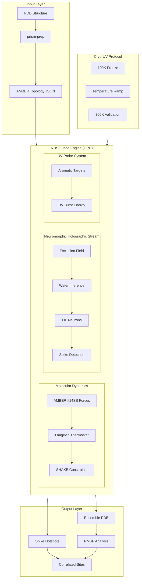
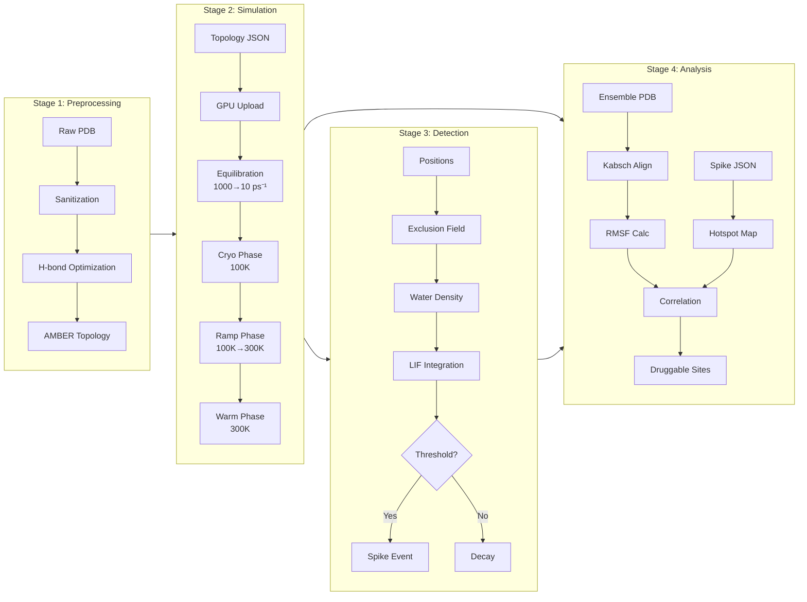

# PRISM4D Cryo-UV System Architecture

## High-Level Architecture



## Data Flow Diagram



## GPU Kernel Architecture

```mermaid
flowchart TB
    subgraph Kernel["nhs_amber_fused.cu"]
        subgraph Forces["Force Calculation"]
            F1[Bond Forces]
            F2[Angle Forces]
            F3[Dihedral Forces]
            F4[LJ + Coulomb]
        end

        subgraph Integration["Velocity Verlet"]
            I1[Force Clamping<br>MAX=1000]
            I2[Half-step V]
            I3[Langevin Kick]
            I4[Velocity Clamping<br>MAX=100]
            I5[Position Update]
        end

        subgraph Water["Water Inference"]
            W1[Atom→Grid Splat]
            W2[Exclusion Sum]
            W3[Polar Enhancement]
            W4[Density = Bulk × (1-Excl)]
        end

        subgraph Neuro["LIF Detection"]
            N1[ΔDensity]
            N2[Noise Floor 0.002]
            N3[Signal × 10]
            N4[Membrane += Signal]
            N5[Decay × 1.5τ]
            N6{V > 0.5?}
            N7[SPIKE!]
        end
    end

    Forces --> I1 --> I2 --> I3 --> I4 --> I5
    I5 --> W1 --> W2 --> W3 --> W4
    W4 --> N1 --> N2 --> N3 --> N4 --> N5 --> N6
    N6 -->|Yes| N7
```

## Component Interaction

```
┌─────────────────────────────────────────────────────────────────────────────┐
│                           PRISM4D CRYO-UV STACK                              │
├─────────────────────────────────────────────────────────────────────────────┤
│                                                                              │
│  ┌──────────────┐    ┌──────────────┐    ┌──────────────┐                   │
│  │   prism-io   │    │  prism-core  │    │ prism-physics│                   │
│  │  PDB/Topology│    │   Telemetry  │    │   Constants  │                   │
│  └──────┬───────┘    └──────┬───────┘    └──────┬───────┘                   │
│         │                   │                   │                           │
│         └───────────────────┼───────────────────┘                           │
│                             │                                               │
│                             ▼                                               │
│  ┌─────────────────────────────────────────────────────────────────────┐   │
│  │                         prism-nhs                                    │   │
│  │  ┌─────────────┐  ┌─────────────┐  ┌─────────────┐  ┌────────────┐  │   │
│  │  │fused_engine │  │  pipeline   │  │  avalanche  │  │  uv_bias   │  │   │
│  │  │             │  │             │  │             │  │            │  │   │
│  │  │ • Langevin  │  │ • Exclusion │  │ • Cascade   │  │ • Targets  │  │   │
│  │  │ • SHAKE     │  │ • Water Inf │  │ • Hotspots  │  │ • Bursts   │  │   │
│  │  │ • Protocol  │  │ • LIF Net   │  │ • Mapping   │  │ • Causal   │  │   │
│  │  └──────┬──────┘  └──────┬──────┘  └──────┬──────┘  └─────┬──────┘  │   │
│  │         └─────────────────┼─────────────────┴─────────────┘         │   │
│  └───────────────────────────┼─────────────────────────────────────────┘   │
│                              │                                              │
│                              ▼                                              │
│  ┌─────────────────────────────────────────────────────────────────────┐   │
│  │                         prism-gpu                                    │   │
│  │  ┌─────────────────────────────────────────────────────────────┐    │   │
│  │  │                   nhs_amber_fused.cu                         │    │   │
│  │  │                                                              │    │   │
│  │  │   AMBER Forces    Langevin     Exclusion    LIF Neurons     │    │   │
│  │  │   ───────────    ─────────    ──────────   ────────────     │    │   │
│  │  │   bond_force()   thermostat() compute_     lif_update()     │    │   │
│  │  │   angle_force()  velocity()   exclusion()  spike_check()    │    │   │
│  │  │   dihedral()     position()   infer_water()                 │    │   │
│  │  │   nonbonded()                                               │    │   │
│  │  └─────────────────────────────────────────────────────────────┘    │   │
│  └─────────────────────────────────────────────────────────────────────┘   │
│                              │                                              │
│                              ▼                                              │
│  ┌─────────────────────────────────────────────────────────────────────┐   │
│  │                         CUDA Runtime                                 │   │
│  │                    cudarc / NVIDIA Driver                            │   │
│  └─────────────────────────────────────────────────────────────────────┘   │
│                              │                                              │
│                              ▼                                              │
│  ┌─────────────────────────────────────────────────────────────────────┐   │
│  │                         GPU Hardware                                 │   │
│  │                    RTX 3060+ / CUDA 12.0+                            │   │
│  └─────────────────────────────────────────────────────────────────────┘   │
│                                                                              │
└─────────────────────────────────────────────────────────────────────────────┘
```

## Temperature Protocol

```
Temperature (K)
     │
 300 ┼─────────────────────────────────────────────────●━━━━━━━━━
     │                                              ╱
     │                                           ╱
     │                                        ╱
     │                                     ╱      Ramp Phase
     │                                  ╱         (50K steps)
     │                               ╱
     │                            ╱
     │                         ╱
     │                      ╱
 100 ┼━━━━━━━━━━━━━━━━━━━●
     │   Survey Phase
     │   (50K steps)
     │
     └────┬─────────────┬─────────────┬─────────────┬──────────→ Steps
          0          50000        100000       150000

     Friction (γ):
     ━━━━━━━━━━━━━━━━━━━━━━━━━━━━━━━━━━━━━━━━━━━━━━━━━━━━━━━━━━

1000 ┼●
     │ ╲
     │  ╲   Equilibration Decay
     │   ╲  γ = 1000·e^(-3t) + 10·(1-e^(-3t))
     │    ╲
     │     ●━━━━━━━━━━━━━━━━━━━━━━━━━━━━━━━━━━━━━━━━━━━━━━━━━
  10 ┼      Base friction: 10 ps⁻¹
     │
     └────┬─────────────┬─────────────────────────────────────→
          0         10000
```

## Spike Detection Circuit

```
                    Water Density Signal
                           │
                           ▼
                    ┌──────────────┐
                    │   ΔDensity   │
                    │  curr - prev │
                    └──────┬───────┘
                           │
                           ▼
                    ┌──────────────┐
                    │ Noise Floor  │
                    │   > 0.002?   │
                    └──────┬───────┘
                           │ Yes
                           ▼
                    ┌──────────────┐
                    │  Amplify     │
                    │    × 10      │
                    └──────┬───────┘
                           │
                           ▼
    ┌──────────────────────────────────────────┐
    │           LIF Neuron                      │
    │  ┌─────────────────────────────────────┐ │
    │  │     Membrane Potential (V)          │ │
    │  │                                     │ │
    │  │  V(t+1) = V(t)·e^(-dt/1.5τ) + I(t)  │ │
    │  │                                     │ │
    │  └─────────────────────────────────────┘ │
    │                    │                      │
    │                    ▼                      │
    │            ┌───────────────┐              │
    │            │  V > 0.5 ?    │              │
    │            └───────┬───────┘              │
    │                    │                      │
    │         ┌──────────┴──────────┐          │
    │         │                     │          │
    │        Yes                    No         │
    │         │                     │          │
    │         ▼                     ▼          │
    │  ┌────────────┐       ┌────────────┐    │
    │  │   SPIKE!   │       │   Decay    │    │
    │  │  V = 0     │       │  Continue  │    │
    │  └────────────┘       └────────────┘    │
    └──────────────────────────────────────────┘
```
